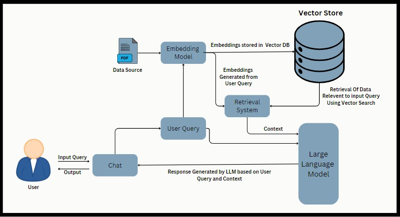
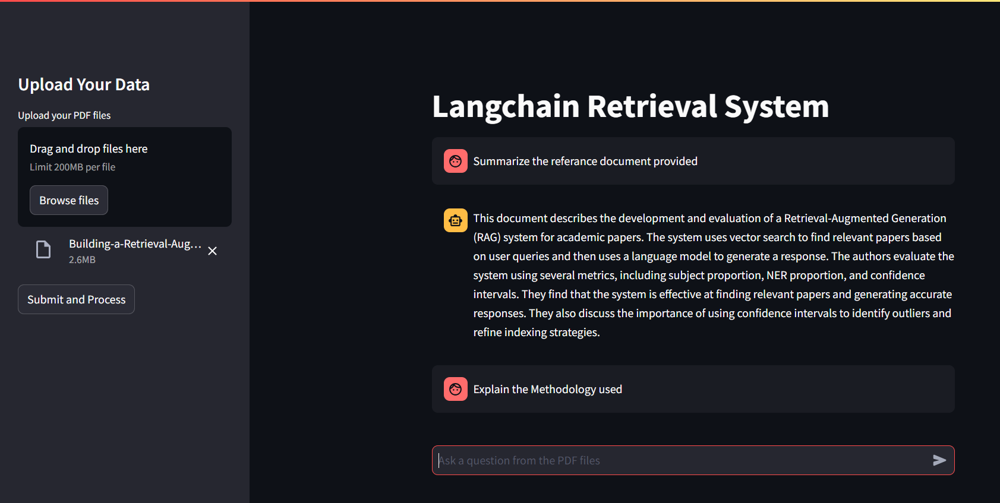

# DocChat: Langchain Retrieval System

This Streamlit application implements a Langchain-based retrieval system for processing PDF documents and conducting conversational retrieval using Langchain's capabilities.
- **Read More**: [here](https://bit.ly/3ygSQBH)


## RAG Architecture


## Streamlit UI



## Overview

DocChat is a Langchain-based retrieval system that processes PDF documents and creates a conversational retrieval chain. It leverages multiple technologies to extract text, generate embeddings, and enable chat-based querying over processed content.

### Tech Stack

- **FastAPI** – Serves as the backend API for processing PDFs and handling chat requests.
- **Streamlit** – Provides the frontend user interface for uploading PDFs and interacting with the conversational system.
- **Langchain** – A core library for NLP tasks such as text splitting and conversational retrieval.
- **Google Palm & Google Generative Language** – Used for generating embeddings.
- **FAISS** – Facebook AI Similarity Search used for efficient similarity search over embeddings.
- **PyMuPDF (fitz)** – Extracts text from PDFs.
- **Docker & Docker Compose** – Containerizes and orchestrates the backend and frontend applications.
- **Python-dotenv** – Loads environment variables (e.g. API keys) from a `.env` file.

## Project Setup

### Prerequisites

1. **Python Environment**: Python 3.x is required.
2. **Environment Variables**: Create a `.env` file in the project root with the content:
   ```
   GOOGLE_API_KEY=your_google_api_key_here
   ```
   Replace `your_google_api_key_here` with your actual Google API key.

### Installation (Local Setup)

1. **Clone the Repository**:
   ```bash
   git clone https://github.com/Varunv003/langchain-palm2-rag_application
   ```
2. **Set Up Virtual Environment**:
   ```bash
   python -m venv venv
   # On Windows:
   .\venv\Scripts\activate
   # On macOS/Linux:
   source venv/bin/activate
   ```
3. **Install Dependencies**:
   ```bash
   pip install -r requirements.txt
   ```
4. **Initialize Folder Structure** (if needed):
   ```bash
   python template.py
   ```
5. **Running the Streamlit App (Frontend)**:
   ```bash
   streamlit run app.py
   ```
   The application will be available at [http://localhost:8501](http://localhost:8501).
6. **Running the FastAPI App (Backend)**:
   ```bash
   uvicorn main:app --reload --host 0.0.0.0 --port 8000
   ```
   The backend API will be available at [http://localhost:8000](http://localhost:8000).

## Running with Docker

This project includes Dockerfiles for both the FastAPI backend and the Streamlit frontend. Docker Compose is used to orchestrate both services.

### Building and Running via Docker Compose

1. **Ensure Docker Desktop is Running.**
2. **From the project root (where the `docker-compose.yml` is located), run:**
   ```bash
   docker-compose up --build
   ```
3. **Services**:
   - **Backend (FastAPI)** will be available at [http://localhost:8000](http://localhost:8000).
   - **Frontend (Streamlit)** will be available at [http://localhost:8501](http://localhost:8501).

### Docker Compose File Structure

Your `docker-compose.yml` defines two services:
- **backend**: Built using `Dockerfile.backend` and exposing port 8000.
- **frontend**: Built using `Dockerfile.frontend` and exposing port 8501, with a dependency on the backend service.

## Usage

- **Upload PDFs**: Use the sidebar in the Streamlit interface to upload PDF files.
- **Process Documents**: Click "Submit and Process" to extract text, generate embeddings, and initialize the conversational chain.
- **Chat**: Ask questions related to the processed PDFs through the chat interface. The backend retrieves and forms responses using the Langchain conversational chain.

## Future Improvements

- Enhance error handling and user feedback.
- Optimize scalability and performance for larger documents.
- Integrate additional AI models or refine existing conversational models for improved responses.